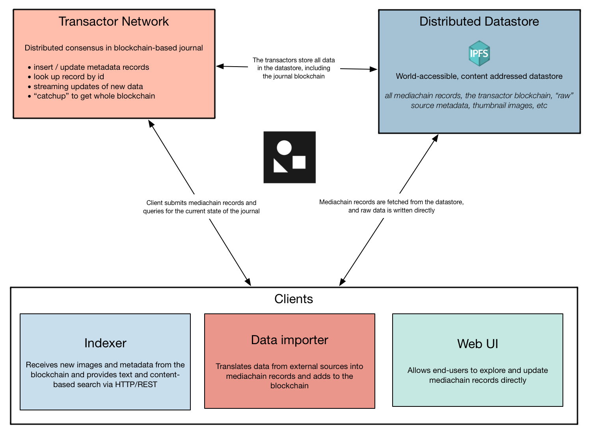
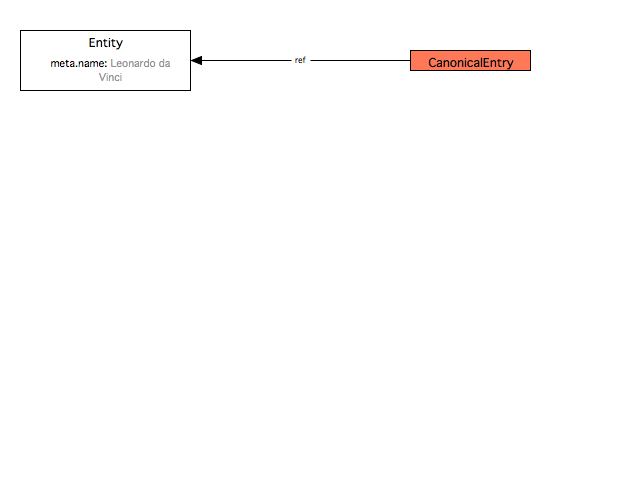

### DEPRECATED in favor of new design, see https://github.com/mediachain/concat/ + https://github.com/mediachain/aleph

# Mediachain 💿 🔗

The primary Mediachain repo. Contains interface definitions and the Transactor implementation. Please see [the RFC](rfc/mediachain-rfc-2.md) for the system design.

The testnet is operational! See [the testnet docs](docs/testnet.md) for details.

## Mediachain System Layout

## Blockchain Extension

[Mediachain Blog](https://blog.mediachain.io/)

[Developer Update X](https://blog.mediachain.io/mediachain-developer-update-x-c0b8cc7fc12c)

[How Mediachain Works](https://blog.mediachain.io/how-mediachain-works-5a5ccc1c3210)

Join the Mediachain community on Slack: http://slack.mediachain.io
